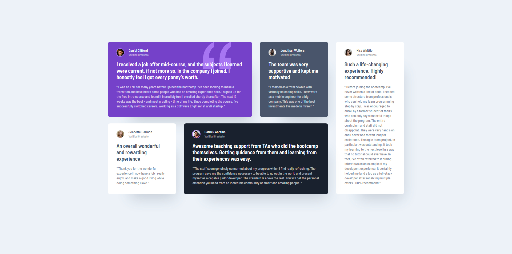

# Frontend Mentor - Testimonials grid section solution

This is a solution to the [Testimonials grid section challenge on Frontend Mentor](https://www.frontendmentor.io/challenges/testimonials-grid-section-Nnw6J7Un7). Frontend Mentor challenges help you improve your coding skills by building realistic projects. 

## Table of contents

- [Overview](#overview)
  - [The challenge](#the-challenge)
  - [Screenshot](#screenshot)
  - [Links](#links)
- [My process](#my-process)
  - [Built with](#built-with)
  - [What I learned](#what-i-learned)
  - [Continued development](#continued-development)
- [Author](#author)

## Overview

### The challenge

Users should be able to:

- View the optimal layout for the site depending on their device's screen size

### Screenshot



### Links

- Solution URL: [Frontend Mentor solution](https://www.frontendmentor.io/solutions/responsive-testimonials-layout-using-css-grid-DL9zlW_1Ad)
- Live Site URL: [live site](https://dusha2.github.io/testimonials_grid_section/)

## My process

### Built with

- Semantic HTML5 markup
- CSS custom properties
- CSS Grid
- Mobile-first workflow
- Accessibility best practices (ARIA labels, visually hidden text)

### What I learned

Working on this challenge was a great opportunity to dive deeper into CSS Grid and web accessibility. I focused on making the layout as robust and flexible as possible.

One of the key takeaways was moving away from fixed heights and using the `minmax()` function in CSS Grid to allow cards to grow naturally with their content:

```css
section {
    display: grid;
    grid-template-columns: repeat(4, 1fr);
    grid-template-rows: minmax(282px, auto) minmax(266px, auto);
}
```

I also learned how to completely restructure the grid for mobile devices and easily push specific elements to the bottom using the order property without changing the HTML structure:

```css
@media (max-width: 768px) {
    .article-three {
        order: 1; 
    }
}
```

On the HTML side, I improved my semantic markup and screen reader compatibility by linking the section to a hidden heading:

```css
<section class="container" aria-labelledby="testimonials-heading">
  <h2 id="testimonials-heading" class="visually-hidden">Student Testimonials</h2>
</section>
```

### Continued development

In future projects, I want to continue mastering advanced CSS Grid techniques to build even more complex responsive layouts. 

## Author

- GitHub - [Roman Dushyn](https://github.com/Dusha2)
- Frontend Mentor - [@Dusha2](https://www.frontendmentor.io/profile/Dusha2)
